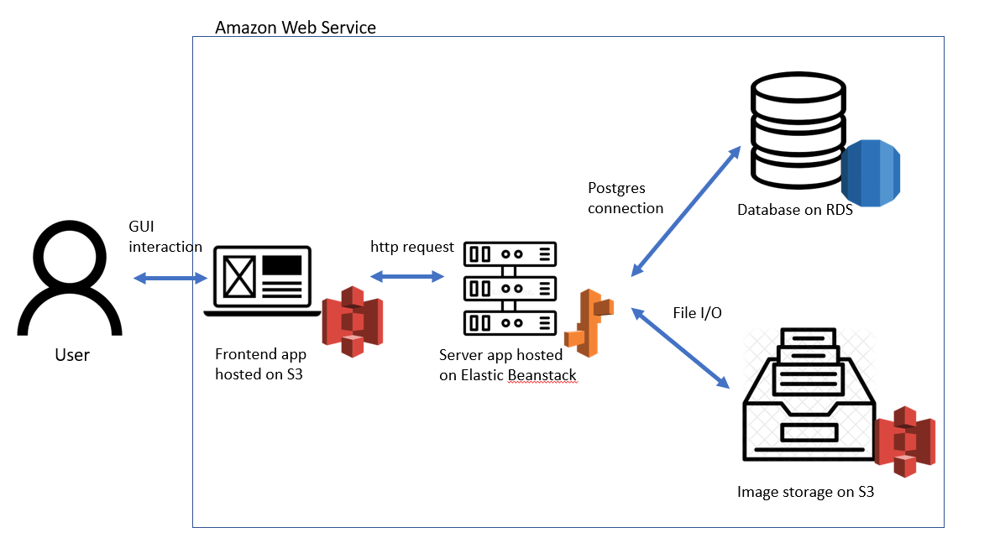

# Udagram

This project is part of the Udacity FullStack JavaScript nanodegree. The code was given as a starter project and the task was to employ and adapt the code to get it working and hosted on AWS.

See additional documentation in the documentation folder. The running site is at http://ugramfront.s3-website-us-east-1.amazonaws.com/

You are welcome to use the following user / admin login 
or register yourself: 
| Username      | password | function
| ----------- | ----------- | ---- |
| user@corp.com      | user       | shopping |
| admin@corp.com   | admin        | stocking |

## App walk through
main

login

shopping list

shopping kart

admin stock management

admin user management

## Configuration Screenshots

### Elastic Beanstalk Environment

### FrontEnd S3 Bucket

### Media S3 Bucket

### PostgreSQL RDS database

### CircleCI Pipeline

added secrets here

Schema

### Architecture

## Built With

- [Angular](https://angular.io/) - Single Page Application Framework
- [Node](https://nodejs.org) - Javascript Runtime
- [Express](https://expressjs.com/) - Javascript API Framework

## License

[License](LICENSE.txt)
